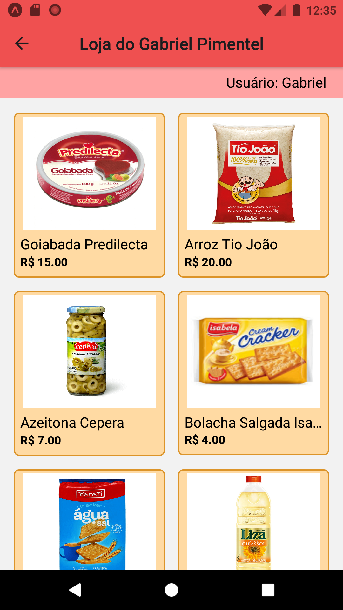
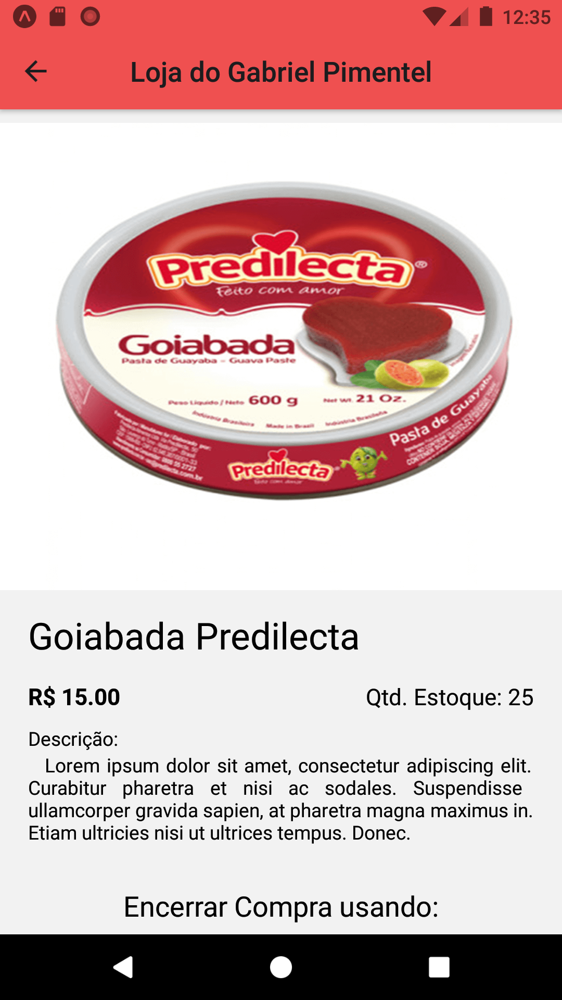
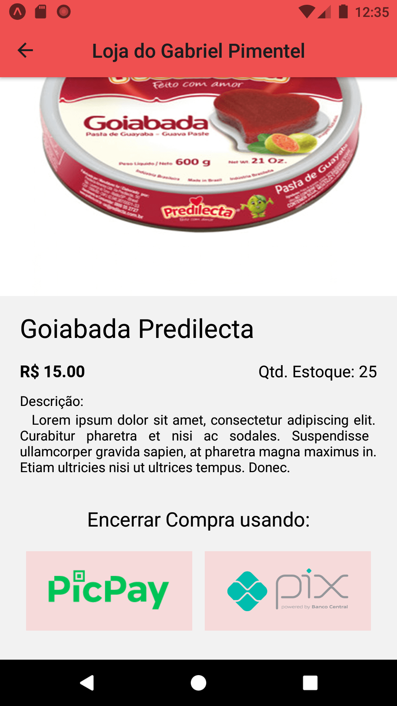

# applojaproduto-react-native-expo
Exemplo de app para vender produtos online escrito em react-native e expo.
<h2>App Baratinho</2>

Construido como requisito parcial da segunda avaliação de tópicos especiais, no curos de Análise e Desenvolvimento de Sistemas

<h4>Tela 01</h4>

<h4>Tela 02</h4>

<h4>Tela 3</h4>

